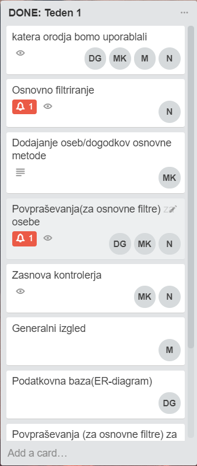
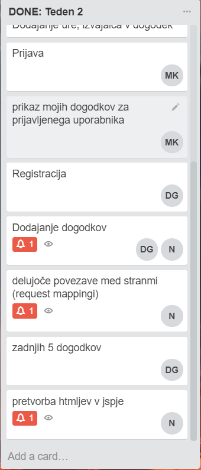
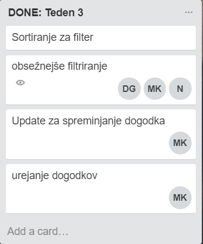
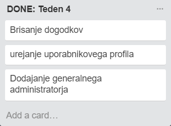

>Projekt v sklopu predmeta Praktikum 1, FERI ITK UN 1. letnik

## O projektu
Glavni namen spletne strani Kultrunik, je prikaz različnih dogodkov v Sloveniji, ki so razdeljeni po
naslednjih tematskih sklopih:
* glasba
* gledališče
* razstave
* športni dogodki
* kino.

Podatke od dogodkih pridobivamo na dva načina. Prvi način je razčlenjevanje podatkov, ki jih dobimo s strani RSS virov :
* [Izbranih zadnjih 5 dogodkov](https://www.napovednik.com/spoznajte/izbordogodkov.php)
* [Dogodki iz evenitma](http://www.eventim.si/si/rss/)
* [Filmi iz Koloseja](https://www.kolosej.si/spored/xml/2.0/)

Drugi način pa je dodajanje dogodkov prijavljenih uporabnikov. Obvezni podatki za vse dogodke so naslednji: 
* naziv, 
* kraj
* datum
* ura
* izvajalec/nastopajoči
* dvorana/prostor
* cena 
* opis
* dogodek ima lahko tudi sliko. 

Vse dogodke, ki jih prikazuje stran Kulturnik.si, lahko tudi urejamo. Vse dogodke lahko spreminja zgolj administrator, ki ima za to dodeljene pravice, ostali uporabniki lahko spreminjano zgolj njihove dodane dogodke. Razlog za to je morebitna naknadna sprememba datuma dogodka, sprememba ure, dodajanje razširjenega opisa dogodka, slik ipd. Neregistrirani uporabnik lahko na spletni strani prosto brska med dogodki, ponujeno pa mu je tudi napredno iskanje s filtri. Na dnu strani pa je omogočen tudi izvoz dogodkov za naslednjih 14 dni v obliki XML. 

## Kompatibilnost

|       Java        | Maven |
| ----------------- |------|
| `1.8`             | `1.0`|

## Kazalo 
* [O projektu](#O-projektu)
* [Inštalacija in uporaba](#Inštalacija-in-uporaba)
* [Glavne funkcionalnosti](#Glavne-funkcionalnosti)
* [Dokumentaicja](#Dokumentacija)
* [Podatkovna baza](#Podatkovna-baza)
* [Potek dela po tednih](##Potek-dela-po-tednih)
* [Avtorji](#Avtorji)
* [Vključene knjižnice](##Vključene-knjižnice)

## Inštalacija in uporaba
Če želite tudi sami zagnati spletno stran na localhost:8080, za to potrebujete GitHub Desktop 
in poljubno integrirano razvojno okolje, ki omogoča inštalacijo maven projekta.
Nato v GitHub Desktop-u kopirate naš repozitorij
> `$ git clone https://github.com/WiiTheThird/Kulturnik.git`

Nato izberete
> `$ git branch Kontroler`

Za tem pa iz oddaljenega (remote) repozitorija 
> `$ git pull origin` 

da dobite zadnjo posodobljeno verzijo. Nato zaženete poljubno IDE okolje in odprete projekt ost_demo, IDE
vam bi moral predlagati vnos (import) potrebnih maven knjižnic. Nato zaženete naš projekt
> `$ git run Zagonski` 

V poljuben brskalnik vpišete localhost:8080/h2 in si vzpostavite lokalno bazo, skripto najdete [tukaj](skripta.sql).

## Glavne funkcionalnosti
Glavne funkcionalnosti naše spletne strani so: 
* registracija novih uporabnikov (registriranim uporabnikom pa omogočamo dodajanje dogodkov)
* urejanje lastnega profila
* dodajanje dogodkov na spletno stran
* urejanje dogodkov, zato da ob morebitnih spremembah dogodkov, še zmeraj nudimo pravilne podatke  
* iskanje dogodkov:
	* glede na tematske sklope (glasba, gledališče, razstave, športni dogodki, kino)
	* po osnovnih filtrih (naziv, kraj)
	* po naprednih filtrih (datum pričetka dogodka, maksimalni cenovni rang)
* sortiranje dogodkov glede na ceno (najcenejše/najdražje) ali glede na abecedni vrstni red naziva
* zbranih zadnijh 5 dogodkov, ki so bili dodani v našo bazo
* zbrani dogodki, ki se bodo odvili nocoj
* prikazovanje vseh dogodkov na zemljevidu
* izpis dogodkov, ki se zgodijo na določeni lokaciji
* prikaz posameznega dogodka z natančno lokacijo v Google Maps (kar omogoča uporabnikom lažje iskanje prizorišča dogodka)
* zbiranje podatkov o dogodkih iz drugih virov
* izvoz podatkov o vseh dogodkih zbranih in dodanih na našo stran

## Dokumentacija

[Zagonski](Kulturnik/Javadoc/Zagonski/index.html)

## Podatkovna baza
[E-R model](ER-D.pdf) oblikovane podatkovne baze, ter [Skripta](skripta.sql) za vzpostavitev podatkovne baze na localhost:8080/h2 

## Potek dela po tednih

Za vsak prihajajoči teden smo si organizirali in porazdelili delo, ter si določili cilje, ki jih želimo doseči. Na naslednjih slikah je prikaz porazdelitve dela v petih tednih.

     

## Avtorji
|
 |
|
|
:---: |:---: |:---: |:---: |
[Marko Gluhak](https://github.com/MerceneX) |[Maruša Konečnik](https://github.com/marusakonecnik) |[Dejan Gregorc](https://github.com/WiiTheThird) |[Nina Kliček](https://github.com/KlicekNina) 

## Vključene knjižnice
> * 
> * [ajax.googleapis](http://ajax.googleapis.com/ajax/libs/jquery/1/jquery.min.js) 
> * [captcha-servlet](https://mvnrepository.com/artifact/com.agapsys.libs/captcha-servlet) 
> * [h2database](http://www.h2database.com/html/main.html) 
> * [java.io](https://docs.oracle.com/javase/7/docs/api/java/io/package-summary.html) 
> * [java.net](https://docs.oracle.com/javase/7/docs/api/java/net/package-summary.html) 
> * [java.sql](https://docs.oracle.com/javase/7/docs/api/java/sql/package-summary.html) 
> * [java.util](https://docs.oracle.com/javase/7/docs/api/java/util/package-summary.html) 
> * [javax.faces-api](https://mvnrepository.com/artifact/javax.faces/javax.faces-api) 
> * [javax.servlet](https://docs.oracle.com/javaee/7/api/javax/servlet/package-summary.html)
> * [javax.xml.bind](https://mvnrepository.com/artifact/javax.xml.bind/jaxb-api/2.1) 
> * [javax.xml.parsers](https://docs.oracle.com/javase/7/docs/api/javax/xml/parsers/package-summary.html) 
> * [jaxb-api](https://mvnrepository.com/artifact/javax.xml.bind/jaxb-api) 
> * [JQuery](https://code.jquery.com/jquery-3.2.1.min.js)
> * [jstl](https://docs.oracle.com/javaee/5/jstl/1.1/docs/tlddocs/) 
> * [Material+Icons](http://archives.materializecss.com/0.100.2/icons.html) 
> * [Material+JS](http://archives.materializecss.com/0.100.2/carousel.html) 
> * [Materialize](http://archives.materializecss.com/0.100.2/getting-started.html)
> * [org.w3c.dom](https://docs.oracle.com/javase/7/docs/api/org/w3c/dom/package-summary.html) 
> * [primefaces](https://mvnrepository.com/artifact/org.primefaces/primefaces) 
> * [spring-boot-maven-plugin](https://docs.spring.io/spring-boot/docs/current/reference/htmlsingle/#build-tool-plugins-maven-plugin)
> * [spring-boot-starter-jdbc](https://docs.spring.io/spring-boot/docs/current/reference/htmlsingle/#boot-features-using-jdbc-template) 
> * [spring-boot-starter-web](https://mvnrepository.com/artifact/org.springframework.boot) 
> * [tomcat-embed-jasper](https://tomcat.apache.org/tomcat-9.0-doc/jasper-howto.html)

